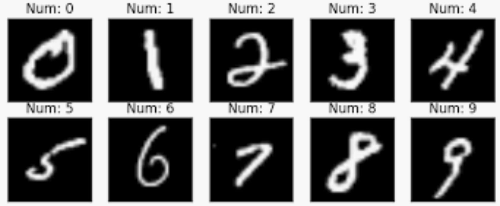

---
jupytext:
  formats: md:myst,ipynb
  text_representation:
    extension: .md
    format_name: myst
    format_version: 0.13
    jupytext_version: 1.17.3
kernelspec:
  display_name: Python 3
  language: python
  name: python3
---

# 3. 第三章 - 尝试解决一个实际问题

+++

目录：
* 3.1 加载 MNIST 数据集
* 3.2 定义模型
* 3.3 选择损失函数和优化器
* 3.4 模型训练并验证
* 3.5 可视化验证

+++

现在，让我们依靠计图的强大力量，解决你的第一个实际问题吧！

```{code-cell} ipython3
:tags: [cuda, skip-execution]

# 加载计图
import jittor as jt

# 开启 GPU 加速
jt.flags.use_cuda = 1
```

## 任务：使用 Jittor 对 MNIST 手写数字进行识别

+++

**任务描述如下：**
* MNIST 手写数字数据库，主要收集了不同人群真实的手写数字记录（包括 0 到 9 十个数字）。该数据库包含训练集上 60,000 个示例，和测试集上 10,000 个示例。数据库详细信息可见：http://yann.lecun.com/exdb/mnist/


* MNIST 手写数字示例：

<!--  -->
<!--  -->


* 目标：利用 Jittor 对 MNIST 手写数字进行识别，辨认出手写数字所要表达的真实数字值。

+++

**解决步骤如下：**
1.  通过 Jittor 加载 MNIST 手写数字的 **数据集**；


2.  定义 **模型** ：设计卷积神经网络；


3.  选择合适的 **损失函数** 和 **优化器**；


4.  完成模型 **训练** 并 **验证** 的主代码块。

+++

## 3.1 加载 MNIST 数据集

+++

由于 MNIST 是一个常见的数据集，为方便使用，其数据已经被封装进 Jittor。我们可以直接调用 MNIST 类，来加载需要的数据集。

```{code-cell} ipython3
:tags: [network, skip-execution]

from jittor.dataset.mnist import MNIST
import jittor.transform as trans

# 设置超参数 batch_size，其值代表一个批次中含有多少个数据。
batch_size = 64

# 创建 MNIST 训练集数据加载器
train_loader = MNIST(train=True, transform=trans.Resize(28)).set_attrs(batch_size=batch_size, shuffle=True)
# 创建 MNIST 测试集数据加载器
val_loader = MNIST(train=False, transform=trans.Resize(28)).set_attrs(batch_size=batch_size, shuffle=False)
```

为了更好地了解 MNIST 手写数字数据集，现在，我们尝试将数据进行可视化展示。
以测试集数据为例：

```{code-cell} ipython3
:tags: [network, skip-execution]

import matplotlib.pyplot as plt

num = 0                                                     # 选择展示第几个 input 数据
for inputs, targets in val_loader:                          # 通过测试集加载器遍历每批次数据
    print("inputs.shape:", inputs.shape)                    # 查看 inputs 的形状
    print("targets.shape:", targets.shape)                  # 查看 targets 的形状

    plt.imshow(inputs[num].numpy().transpose(1, 2, 0))      # 利用 matplotlib 根据第一个 input 绘制手写数字的图像
    plt.show()                                              # 展示图像
    print("target:", targets[num].numpy()[0])                  # 打印第一个 input 数据的真实标签值，即手写数字图像所表达的真实数字
    break
```

通过上述打印信息，可以看到：
* 加载器每个批次的遍历，无论是 inputs 还是 targets，都包含了 64 个数据。这与我们设置的 batch_size 相符；


* 在 inputs 中，每个数据实质为 3 个通道，每个通道包含 28\*28 个像素点的数字集合。我们可以通过 imshow() 函数画出对应的手写数字图像；


* targets 中的每个数据，实质为 1 个数字，即手写数字图像所表达的真实数字值。

+++

## 3.2 定义模型

+++

同样，我们需要继承 Module 类，并实现 \_\_init__ 函数和 execute 函数:

```{code-cell} ipython3
from jittor import nn, Module

class Model(Module):
    def __init__(self):
        super(Model, self).__init__()
        self.conv1 = nn.Conv(3, 32, 3, 1)           # 卷积层 1，参数含义：该层输入通道 3，输出通道 32，卷积核大小 3*3，移动步长为 1
        self.conv2 = nn.Conv(32, 64, 3, 1)          # 卷积层 2，参数含义：该层输入通道 32，输出通道 64，卷积核大小 3*3，移动步长为 1
        self.bn = nn.BatchNorm(64)                  # 批量归一化层，参数含义：该层输入通道数为 64

        self.max_pool = nn.Pool(2, 2)               # 池化层，参数含义：窗口大小为 2，窗口移动步长为 2
        self.relu = nn.Relu()                       # 非线性激活函数 Relu
        self.fc1 = nn.Linear(64 * 12 * 12, 256)     # 线性全连接 1，参数含义：输入通道数 64*12*12（由上一步reshape变化得来），输出通道数 256
        self.fc2 = nn.Linear(256, 10)               # 线性全连接 2，参数含义：输入通道数 256，输出通道数 10

    def execute(self, x) :
        x = self.conv1(x)                           # 作用第一层卷积层，输入由 batch_size*3*28*28 变为输出 batch_size*32*26*26
        x = self.relu(x)                            # 通过非线性激活函数 Relu

        x = self.conv2(x)                           # 作用第二层卷积层，输入由 batch_size*32*26*26 变为输出 batch_size*64*24*24
        x = self.bn(x)                              # 批量归一化操作
        x = self.relu(x)                            # 通过非线性激活函数 Relu

        x = self.max_pool(x)                        # 池化操作，输入由 batch_size*64*24*24 变为输出 batch_size*64*12*12
        x = jt.reshape(x, [x.shape[0], -1])         # 将 x 压缩成只保留第一维度，输入由 batch_size*64*12*12 变为输出 batch_size*(64*12*12)
        x = self.fc1(x)                             # 作用第一层全连接，输入由 batch_size*(64*12*12) 变为输出 batch_size*256
        x = self.relu(x)                            # 通过非线性激活函数 Relu
        x = self.fc2(x)                             # 第二层全连接，并控制最后输出为 batch_size*10，每个数据的 10 个分量，分别代表十个数字的相似度
        return x
```

接下来，我们创建一个模型实例：

```{code-cell} ipython3
model = Model()
```

## 3.3 选择损失函数和优化器

+++

在本次实践中，我们采用交叉熵损失函数 CrossEntropyLoss()，以及随机梯度下降 (Stochastic Gradient Descent, SGD) 作为参数优化器。
这些常用的损失函数和优化器我们可以通过计图的 nn 类获取得到。

```{code-cell} ipython3
# 设置损失函数
loss_function = nn.CrossEntropyLoss()

# 设置优化器
learning_rate = 0.1
momentum = 0.9
weight_decay = 1e-4
optimizer = nn.SGD(model.parameters(), learning_rate, momentum, weight_decay)
```

## 3.4 模型训练并验证

```{code-cell} ipython3
:tags: [cuda, network, long-running, skip-execution]

import numpy as np

# 训练函数
def train(model, train_loader, loss_function, optimizer, epoch):
    model.train()                                                       # 开启训练模式
    train_losses = list()                                              # 初始化 Loss 容器，用于记录每一批次的 Loss
    for batch_idx, (inputs, targets) in enumerate(train_loader):       # 通过训练集加载器，按批次迭代数据
        outputs = model(inputs)                                        # 通过模型预测手写数字。outputs 中每个数据输出有 10 个分量，对应十个数字的相似度
        loss = loss_function(outputs, targets)                         # 计算损失函数
        optimizer.step(loss)                                           # 根据损失函数，对模型参数进行优化、更新
        train_losses.append(loss.item())                                      # 记录该批次的 Loss

        if batch_idx % 10 == 0:                                        # 每十个批次，打印一次训练集上的 Loss
            print('Train Epoch: {} [{}/{} ({:.0f}%)]\tLoss: {:.6f}'.format(
                    epoch, batch_idx, len(train_loader),
                    100. * batch_idx / len(train_loader), loss.item()))
    return train_losses                                                # 返回本纪元的 Loss


# 测试函数
def test(model, val_loader, loss_function, epoch):
    model.eval()                                                       # 开启训练模式
    total_correct = 0                                                  # 本纪元预测正确总次数
    total_num = 0                                                      # 本纪元数据总数
    for batch_idx, (inputs, targets) in enumerate(val_loader):         # 通过测试集加载器，按批次迭代数据
        outputs = model(inputs)                                        # 通过模型预测手写数字。outputs 中每个数据输出有 10 个分量，对应十个数字的相似度
        pred = np.argmax(outputs.numpy(), axis=1)                      # 根据 10 个分量，选择最大相似度的为预测的数字值
        correct = np.sum(targets.numpy()==pred)                        # 计算本批次中，正确预测的次数，即数据标签等于预测值的数目
        batch_size = inputs.shape[0]                                   # 计算本批次中，数据的总数目
        acc = correct / batch_size                                     # 计算本批次的正确率

        total_correct += correct                                       # 将本批次的正确预测次数记录到总数中
        total_num += batch_size                                        # 将本批次的数据数目记录到总数中

        if batch_idx % 10 == 0:                                        # 每十个批次，打印一次测试集上的准确率
            print('Test Epoch: {} [{}/{} ({:.0f}%)]\tAcc: {:.6f}'.format(epoch, \
                        batch_idx, len(val_loader),100. * float(batch_idx) / len(val_loader), acc))
    test_acc = total_correct / total_num                               # 计算本纪元的正确率
    print ('Total test acc =', test_acc)
    return test_acc


# 设置纪元数，并开始训练和测试模型
epochs = 5
train_losses = list()
test_acc = list()
for epoch in range(epochs):
    loss = train(model, train_loader, loss_function, optimizer, epoch) # 训练模型，并返回该纪元的 Loss 列表
    train_losses += loss
    acc = test(model, val_loader, loss_function, epoch)                # 测试模型，并返回该纪元的正确率
    test_acc.append(acc)
```

## 3.5 可视化验证

+++

模型训练完毕。最后，我们利用可视化工具，直观感受下我们的训练结果吧！

+++

* **训练集: Loss 下降趋势**

```{code-cell} ipython3
:tags: [network, long-running, skip-execution]

plt.plot(train_losses, label="Training Loss")
plt.xlabel("Iterations")
plt.ylabel("Loss")
plt.legend()
plt.show()
```

* **测试集: 正确率上升状况**

```{code-cell} ipython3
:tags: [network, long-running, skip-execution]

plt.plot(test_acc, label="Test Accuracy")
plt.xlabel("Epochs")
plt.ylabel("Accuracy")
plt.legend()
plt.show()
```

* **模型预测效果**

我们在测试集上观看一下预测效果：

```{code-cell} ipython3
:tags: [cuda, network, long-running, skip-execution]

num = 9                                                       # 选择查看第几个数据的验证效果
for inputs, targets in val_loader:

    plt.imshow(inputs[num].numpy().transpose(1, 2, 0))        # 绘制该数据的手写数字图像
    plt.show()

    print("target:", targets[num].numpy()[0])                    # 打印该数据的真实标签值

    outputs = model(inputs)                                   # 模型根据输入数据进行预测
    pred = np.argmax(outputs.numpy(), axis=1)                    # 根据最大相似度得到预测值
    print("prediction:", pred[num])                           # 打印该数据的预测值
    break
```

# 尾声 📣

恭喜您，已经完成了计图入门教程的所有内容。
现在，您已经是一名合格的计图使用者了。
计图官方时常会举办一些 “人工智能算法挑战赛” ，并附赠丰厚的奖金回报。作为一名合格的计图使用者，请来大赛中斩获一席之地吧！🎉🎊🎈

更多学习资料，可以参考：

*  [在线PyTorch转Jittor工具](https://cg.cs.tsinghua.edu.cn/jittor/news/2020-12-13-20-40-pt_converter/)
*  [PyTorch模型转换指南](https://cg.cs.tsinghua.edu.cn/jittor/tutorial/2020-5-2-16-43-pytorchconvert/)
*  [Jittor文档](https://cg.cs.tsinghua.edu.cn/jittor/assets/docs/index.html)
*  [Jittor模型库](https://cg.cs.tsinghua.edu.cn/jittor/resources/)
*  [Jittor教程](https://cg.cs.tsinghua.edu.cn/jittor/tutorial/)

Jittor还很年轻。 它可能存在错误和问题。 请在我们的错误跟踪系统，QQ群（761222083）中报告它们。 我们欢迎您为Jittor做出贡献。

您可以用以下方式帮助Jittor：

* 在论文中引用 Jittor
* 向身边的好朋友推荐 Jittor
* 贡献代码
* 贡献教程和文档
* 提出issue
* 回答 jittor 相关问题
* 点亮小星星
* 持续关注 jittor

[Jittor Github 地址](https://github.com/jittor/jittor),
[Jittor Gitee 地址](https://gitee.com/jittor/jittor)

求star～您的支持是对我们最大的鼓励！


特别感谢本教程作者：llt
